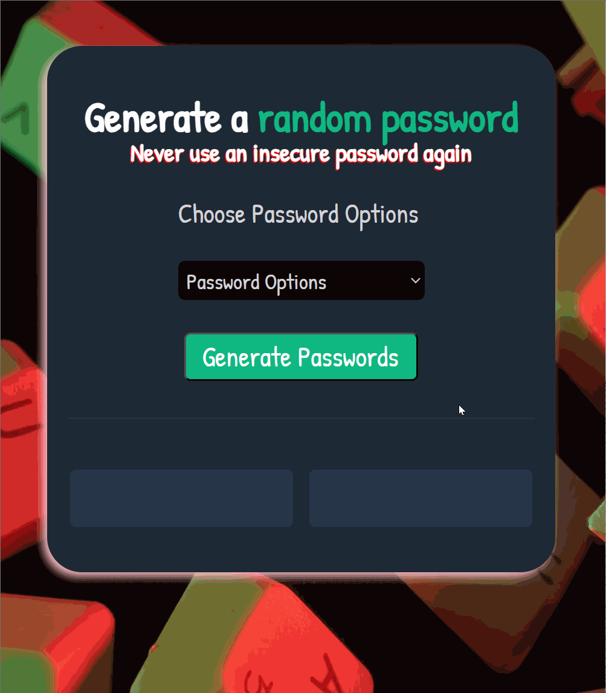

# **Password Generator**

# Overview

Welcome to the Password Generator website! 🔐 This straightforward tool allows you to generate random passwords with ease. Upon opening the website, if you click the "Generate Passwords" button without selecting an option, you will receive an alert instructing you to choose a password option from the dropdown menu. Once an option is selected, clicking the button will generate two random passwords of the chosen type.

# Website

Live Version [here](https://passwordgenerator03.netlify.app/)

# Preview

## What I've Learned

The Password Generator project has been a significant step in my journey of DOM manipulation. Here are some key learnings from this project:

- **DOM Manipulation Practice**: Continued practice in manipulating the DOM to create dynamic and responsive web applications.

- **Math.random Library Usage**: Utilized the Math.random library to generate random digits, numbers, or combinations based on the desired input.

- **Conditional Statements**: Implemented conditional statements (if-else) to control the flow of the password generation based on user selections.

- **Array's Filter Method**: Employed the filter method to refine the input and ensure the generated passwords meet the desired criteria.

## Getting Started

Explore the Password Generator by following these steps:

1. Clone the repository.
2. Open the index.html file in your browser.
3. Click the "Generate Passwords" button and follow the instructions in the alert message if no option is selected.
4. Select a password option from the dropdown menu.
5. Click the button again to generate two random passwords based on your chosen option.

## Features

- **Password Options**: Choose from three password options, including 4 Digit Numeric, 7 Digit Alphabetic, and 15 Digit Alphanumeric passwords.

- **Dynamic Alerts**:  Receive clear instructions through dynamic alerts, guiding you to select a password option before generating passwords.

- **Random Password Generation**: Experience the power of Math.random to create truly random passwords based on the chosen criteria.

- **User-Friendly Interface:**: The website provides a straightforward and user-friendly interface for a seamless password generation experience.

# Author

Komal | Software Developer | [Portfolio](https://kaurkomal.com/) | [LinkedIn](https://www.linkedin.com/in/hssa03/)